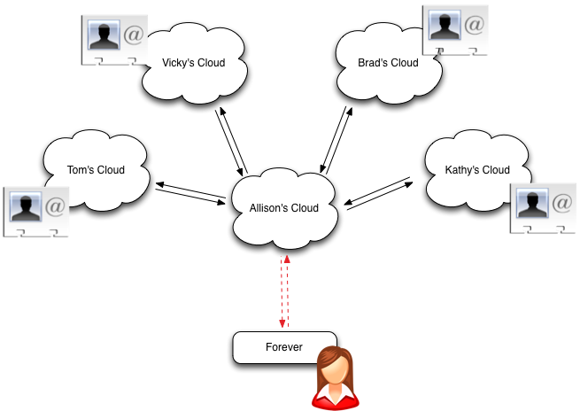

Forever is an evergreen address book. You can see [Forever in action](https://forevr.us). The idea is that rather than everyone storing contact information for their friends and then having it go stale, Forever pulls the contact information in real time when you want to message, email, or call one of your friends.  Here's a picture:

When Allison uses Forever to ask for Brad's phone number, it's pulled from his cloud just as she needs it. Thus Brad could update his number in real-time depending on where he is (home, work, car) and Allison would see the change every time she called. 

Forever is a demonstration application that shows how to construct applications that use personal clouds as the repository for user information. The only data that forever stores is the link between the OAuth token from the user's personal cloud and the browser cookie that establishes the session. 

